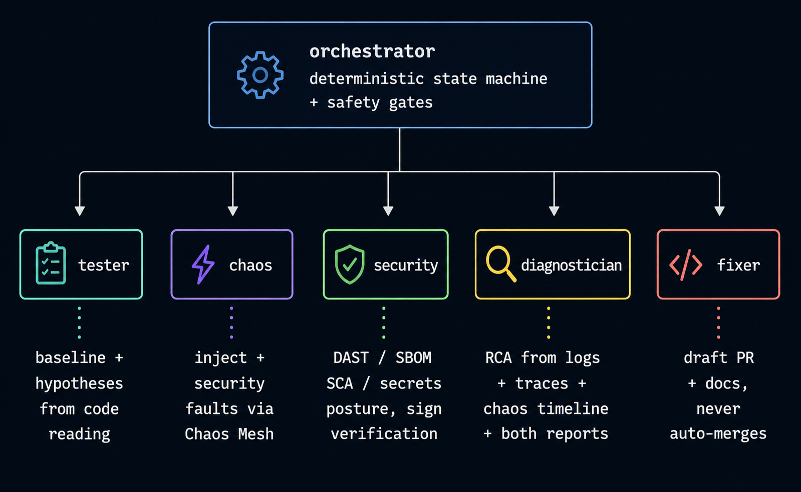
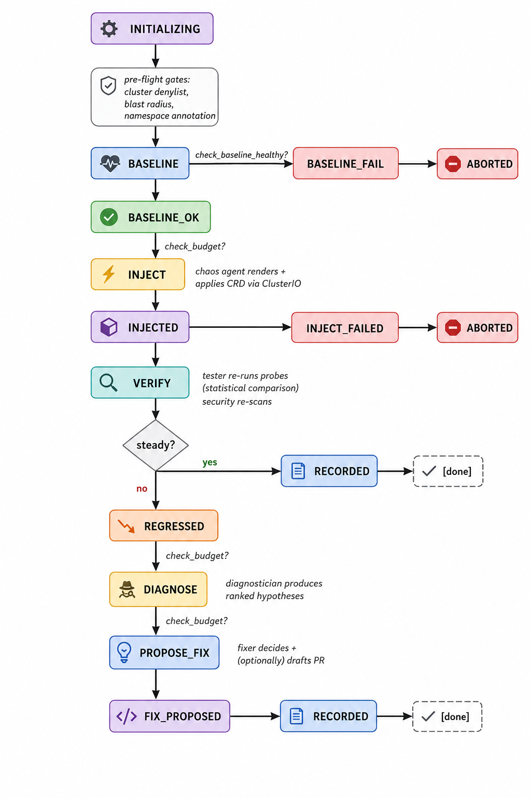
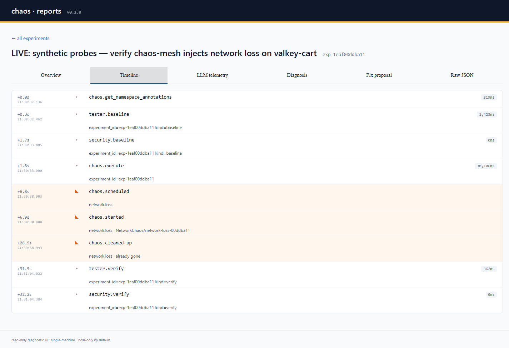

# chaos — closed-loop, security-aware chaos engineering

[](https://github.com/cadneowl/chaos-loop/actions/workflows/ci.yml)
[](pyproject.toml)
[](pyproject.toml)
[](LICENSE)

<p align="center">
  
</p>

A multi-agent system where each agent has a job, a chaos-themed persona,
and zero authority over anyone else's decisions. Meet the full cast in
[**docs/CAST.md**](docs/CAST.md) — including the orchestrator who runs the
band and the meta-harness who audits every musician.

A multi-agent system that **closes the loop** on chaos engineering: it
generates hypotheses by reading the target's source, injects faults via
[Chaos Mesh](https://chaos-mesh.org/), verifies steady state with statistical
baselines, diagnoses regressions with cited evidence, and opens a **draft
PR** with the proposed fix + a regression test.

Inject-only tools like Chaos Mesh, Litmus, AWS FIS, and Gremlin stop after
the fault. A human reads dashboards, files a Jira ticket, opens a PR weeks
later. This system tries to do all of that — *or fail honestly when it
can't*.

And once a weakness is found and fixed, **resilience regression suites** keep
it fixed: replay a curated corpus of scenarios — inheriting the customer's own
Playwright or command test suite as the pass/fail oracle — and report an honest
fault-by-journey coverage matrix. Discovery finds the weakness; regression
proves it stays gone. See [**docs/REGRESSION.md**](docs/REGRESSION.md).

<p align="center">
  
</p>

---

## Table of contents

- [Status](#status)
- [Why this exists](#why-this-exists)
- [What is different](#what-is-different-vs-prior-art)
- [The algorithm](#the-algorithm)
  - [The closed loop, step by step](#the-closed-loop-step-by-step)
  - [Strategy modes: `static` / `hybrid` / `llm`](#strategy-modes-static--hybrid--llm)
  - [Statistical baselines](#statistical-baselines)
  - [Pattern-match detectors](#pattern-match-detectors)
  - [Hybrid merge algorithm](#hybrid-merge-algorithm)
  - [Safety gates](#safety-gates)
  - [The meta-harness: how every AI call is controlled](#the-meta-harness-how-every-ai-call-is-controlled)
- [Installation](#installation)
- [Configuration](#configuration)
- [Operating the system](#operating-the-system)
- [Diagnostic UI](#diagnostic-ui)
- [Test status](#test-status)
- [Repo layout](#repo-layout)
- [Further reading](#further-reading)
- [License](#license)

---

## Status

| Area | State |
|---|---|
| Orchestrator + state machine | working |
| Tester (baseline, verify, hypothesize) | working — Static + Hybrid + LLM strategies |
| Chaos (renderers + KubernetesClusterIO) | working — validated against live Chaos Mesh v2.7+ |
| Security (Trivy + Syft + Grype + gitleaks + cosign + kubescape) | working — opt-in per scanner; SBOM drift detection live |
| Diagnostician | working — Static + Hybrid + LLM strategies |
| Fixer (proposal artifacts) | working; actual file edits + `gh pr create` is M6.x.b |
| Resilience regression suites | working — inherit a Playwright / command suite, replay under fault, fault-by-journey coverage |
| Experiment plugins | working — customer-owned env/test lifecycle with guaranteed teardown |
| LLM backends | Anthropic Claude (default), Ollama (local), any LiteLLM provider |
| Tests | 733 unit tests, 85%+ coverage, mypy strict, ruff clean |

---

## Why this exists

The chaos-engineering toolchain stops at **injection**. Chaos Mesh applies
the CRD; Litmus runs the workflow; Gremlin renders the dashboard — and then
a human reads the result, decides what (if anything) it means, files a
ticket, and (maybe) writes a fix months later.

That gap — between *we induced a regression* and *we have a reviewed
artifact that addresses it* — is where most of the value of chaos
engineering is lost. The point of chaos isn't to break things; it's to
surface latent fragility and **act on it**. Without the loop closing, every
chaos run becomes context dropped on the floor.

This project closes that loop. It is not the first to try (see
[docs/COMPARISON.md](docs/COMPARISON.md) for the landscape) — but it does
several things differently.

---

## What is different (vs. prior art)

1. **Application-code PRs**, not just k8s config edits. The fixer agent
   opens a **draft** PR in the target repo with a proposed code change + a
   regression test + reasoning. Defaults to draft, never auto-merges,
   denylist-enforced.
2. **Security Chaos Engineering is first-class.** Security findings flow
   through the same loop as functional regressions. The diagnostician treats
   `auth.outage` and `network.loss` symmetrically. See
   [docs/SECURITY_CHAOS.md](docs/SECURITY_CHAOS.md).
3. **Deterministic floor under every cognitive seam.** Hypothesize /
   diagnose / propose-fix each have a `Static*` rule-based implementation
   that runs at $0 cost. The LLM augments rather than replaces it. If the
   LLM is missing or fails, the loop still ships a useful result. See
   [Strategy modes](#strategy-modes-static--hybrid--llm).
4. **Multi-backend LLM via LiteLLM.** Works against Anthropic Claude
   (default), local Ollama models (Qwen, Llama, etc.), or any other
   LiteLLM-supported provider with a single flag.
5. **Hard inter-agent contracts.** Every agent has a Pydantic-typed
   input/output schema in `shared/contracts.py`. Agents are swappable;
   non-Claude implementations are first-class.
6. **The orchestrator is deterministic Python.** State transitions, safety
   gates, blast-radius limits, and budget enforcement are code, not LLM
   judgment. The cognitive work is delegated to agents; the safety properties
   are not.
7. **Discovery *and* regression, one engine.** The same loop runs two ways:
   *discover* new weaknesses one fault at a time, or *confirm* a curated corpus
   stays fixed. Regression suites inherit the customer's existing test suite as
   the oracle and report honest, relevant coverage — no separate harness. See
   [docs/REGRESSION.md](docs/REGRESSION.md).

---

## The algorithm

### The closed loop, step by step


The orchestrator (`orchestrator/loop.py`) runs a deterministic state
machine. Each transition is persisted to SQLite so a mid-run crash is
recoverable. *"Everyone in their lane. The state machine doesn't take
requests."*

<p align="center">
  
</p>

**Hard rules baked into the state machine:**

- Baseline already showing regression aborts the experiment **before** any
  fault. Chaos-testing a yellow system can turn it red.
- One fault per experiment unless `allow_multi_fault: true` — attribution
  matters.
- Per-step budget checks: every spend-incurring agent call (LLM-backed
  hypothesize / diagnose / propose-fix) refreshes spend from the harness,
  then re-evaluates the hard cap before the next step.
- The fixer never auto-merges. PRs are always draft.

### Strategy modes: `static` / `hybrid` / `llm`

Each cognitive seam in the loop has multiple implementations behind a
Pydantic-typed Protocol. Pick which mix you want via `--profile` on
`chaos run`:

| Mode | Hypothesize | Diagnose | Propose-fix | Cost | When to use |
|---|---|---|---|---|---|
| **`static`** | `StaticHypothesizer` | `StaticDiagnoser` | `StaticFixerStrategy` | **$0** | CI, default, $0 baseline, fully repeatable runs |
| **`hybrid`** | `Hybrid…` (Static + LLM, merged) | same | same | **$$** | best-effort: Static floor + LLM augment |
| **`llm`** | `Claude…` (LiteLLM) | same | same | **$$$** | production runs with explicit LLM budget |

A fourth tier — `Fixture*` — exists for unit tests and `--dry-run`. All
four implement the same `Hypothesizer` / `Diagnoser` / `FixerStrategy`
Protocol; the orchestrator can't tell them apart.

See [docs/MODES.md](docs/MODES.md) for the per-mode breakdown.

### Statistical baselines

The tester's `baseline()` is **not** a single snapshot. It runs each probe
in the target's probe set N times (default 5) and records a
`StatisticalSample` per metric: samples, mean, p50, p95, p99, stdev.
Percentiles use linear interpolation (NIST `linear` method), so p50 of
`[100, 200, 300, 400]` is `250`, not `300`.

After chaos, `verify()` re-runs the same probes. The comparison is a
**3-σ z-test** on the new mean against the baseline distribution:

```python
z = abs(new_mean - baseline_mean) / baseline_stdev
if z > 3.0:
    flag_as_anomaly()
```

3-σ corresponds to ~0.3% false-positive rate under normality. The threshold
is intentionally conservative — false positives waste the diagnostician's
attention; false negatives are caught by the per-probe pass/fail anyway.

### Pattern-match detectors

`StaticHypothesizer` runs eight detectors over the target's source. Each
emits `Issue` objects that a templating layer turns into catalogue-mapped
`Hypothesis` instances. Zero LLM cost, fully deterministic.

| Detector | Pattern | Maps to chaos fault |
|---|---|---|
| `MissingTimeoutDetector` | `requests.get(...)` / `subprocess.run(...)` without `timeout=` | `network.delay` |
| `MissingRetryDetector` | external-dep call sites in a file with no retry primitive | `network.loss` |
| `MissingCircuitBreakerDetector` | external-dep call sites with no circuit-breaker primitive | `network.partition` |
| `NoFallbackForCacheDetector` | cache GET-shaped call on a known cache client variable, file has no `try/except` | `pod.kill` |
| `SyncCallInAsyncDetector` | `time.sleep` / `requests.*` / sync subprocess inside `async def`, not offloaded | `network.delay` |
| `SingleReplicaDetector` | k8s Deployment with `replicas: 1` | `pod.kill` |
| `HardPodAffinityDetector` | `requiredDuringSchedulingIgnoredDuringExecution` | `pod.kill` |
| `HardcodedSecretDetector` | secret-suggestive names assigned to long string literals (skips env-loaded patterns + comments) | `secret.rotate` |

Detectors live in `agents/tester/detectors/`. Add one by implementing the
`Detector` Protocol (one `find(code) -> list[Issue]` method), adding a
template entry to `_DETECTOR_CONFIG` in `hypothesizer.py`, and registering
in `default_detectors()`.

### Hybrid merge algorithm

`HybridHypothesizer` and `HybridDiagnoser` run **both** Static and LLM,
then merge:

- **Hypothesizer dedup key:** `(proposed_fault, normalized code_references)`.
  References are normalized to `file:line` so two findings on different
  lines of the same file remain distinct.
- **Diagnoser dedup key:** `(suggested_fix_class, overlapping affected_paths)`.
- **Conflict resolution:** higher-confidence wins; non-duplicates from
  both sides are kept; results are sorted by confidence descending.

If the LLM raises, hybrid mode logs a warning and degrades to Static-only.
The loop never breaks because of a transient API issue.

`HybridFixerStrategy` is one-or-the-other (a proposal isn't a list): try
the LLM first; fall back to Static if the LLM raises **or** returns an
empty / trivially-short proposal (`reasoning < 50` chars and no
`files_touched`).

### Safety gates

Four deterministic gates run before any fault is injected
(`orchestrator/safety.py`):

1. **`check_cluster_allowed`** — the configured `cluster_context` must not
   match the substring denylist (default: `prod`, `production`, `live`,
   `main`).
2. **`check_blast_radius`** — one fault per experiment unless
   `allow_multi_fault: true`; per-fault duration ≤
   `max_duration_seconds`.
3. **`check_namespace_annotation`** — the target namespace must carry
   `chaos.kosta.dev/allowed=true`. If the cluster is unreachable, the gate
   **fails closed** — an experiment that can't verify its own targeting
   does not proceed.
4. **`check_baseline_healthy`** — baseline `TesterReport.steady_state` must
   be `True` and `SecurityReport.has_critical_or_high` must be `False`.
   Chaos-testing a system that's already broken yields useless data.

Plus continuous budget enforcement (see next section).

See [docs/SAFETY.md](docs/SAFETY.md) for the full safety model + approval
modes for `requires_approval` faults.

### The meta-harness: how every AI call is controlled


LLMs are the cognitive surface of the system; they are also the surface
that costs money, leaks data, hallucinates, and can loop. Every call into
an LLM-backed agent passes through a **meta-harness** wrapper
(`agents/_harness.py`) that gives the orchestrator one place to enforce
control properties across all five agents. *"Permit, please. Spending
report. Audit log. Move along."*

The wrapper is a `__getattr__` proxy — calling `harness.instrument(name,
agent)` returns a transparent stand-in that satisfies the same Protocol as
the underlying agent. Sync attribute reads pass through; coroutine methods
get instrumented. Wrapped agents are **read-only**: `__setattr__` raises,
so a misbehaving caller can't mutate state on the wrapped instance.

What the wrapper does on every async method invocation:

| Concern | How the harness handles it |
|---|---|
| **Observability** | Logs entry / exit / duration / error / one-line input + output summaries — at INFO on success, WARNING on raise. |
| **Audit trail** | Builds an `AgentInvocation` record and appends it to `Harness.invocations`. The orchestrator attaches the full list to `ExperimentRecord.agent_invocations` before every SQLite save, so a crash mid-run still leaves a forensic trail. |
| **Cost attribution** | Sets a per-task `ContextVar` to the current `AgentInvocation`. When the agent's strategy calls `complete_with_tools`, that function reads the ContextVar and credits the call's `response_cost` to the invocation that triggered it — no harness reference plumbed through three constructors. |
| **Budget enforcement** | After every step in the loop, the orchestrator sums `inv.spend_usd` across `harness.invocations`, persists it on the record, logs once at `soft_cap_usd`, aborts with `BUDGET_EXCEEDED` at `hard_cap_usd` or `wall_clock_seconds`. |
| **Error propagation** | Exceptions ALWAYS propagate. The harness records the error string for the audit log but does **not** swallow. A failing agent fails the experiment — silent partial success is not allowed. |
| **No mutation** | `_Wrapped.__setattr__` blocks writes to the proxy itself; wrapped agents are conceptually frozen views. |

The end-to-end LLM-cost flow looks like this:

```
ExperimentRunner.run()
    └─ awaits  harness_wrapped_tester.hypothesize(req)        ← proxy
                  └─ ContextVar.set(AgentInvocation)
                  └─ awaits  inner_tester.hypothesize(req)
                                └─ awaits  ClaudeHypothesizer.generate(...)
                                              └─ awaits  complete_with_tools(...)
                                                            └─ for each turn:
                                                                  └─ litellm.acompletion()
                                                                  └─ cost = response.usage.cost
                                                                  └─ record_llm_spend(cost)
                                                                        └─ inv.spend_usd += cost   ← ContextVar
                  └─ records AgentInvocation in Harness.invocations
    └─ budget.spent_usd = sum(inv.spend_usd for inv in harness.invocations)
    └─ if budget.hard_exceeded(): abort
```

Why this matters in practice:

- The **orchestrator never sees an LLM call directly**. It only sees
  agent invocations through Protocol interfaces. The harness is the
  border control.
- **Adding a new agent** doesn't require any harness change — just
  `harness.instrument("new-agent", instance)` and it gets the same
  observability / audit / cost / budget enforcement.
- **The control properties hold even when the agent calls multiple
  LLMs.** The ContextVar pattern means N nested `complete_with_tools`
  calls all credit their cost to the one invocation that started the
  outer agent method.
- **Tests can drop the harness** entirely (Fixture* implementations
  don't use LLMs anyway), or use it standalone to verify the invocation
  log matches expectations. `tests/test_harness.py` does both.

Local Ollama runs report cost as 0 (LiteLLM has no pricing data for
self-hosted endpoints), so the budget path gracefully no-ops for
free-tier setups — the observability + audit-trail properties still hold.

---

## Installation

### Prerequisites

- **Python 3.11+** (3.13 recommended; matches the dev box)
- **Docker** (for Chaos Mesh's `kind` test cluster, and for any image scans)
- **kubectl** (any 1.27+; `client-go` v0.29 compatible)
- **kind** (only if you want a local k8s cluster; alternatives: existing
  cluster + Chaos Mesh install)
- **(Optional) Anthropic API key** for `--profile llm` / `--profile hybrid`
  with Claude — sign up at https://console.anthropic.com
- **(Optional) Ollama** for local LLM — https://ollama.com

### 1. Clone and install Python deps

```bash
git clone <this-repo> chaos && cd chaos
python -m venv .venv
source .venv/bin/activate            # POSIX
# .\.venv\Scripts\Activate.ps1       # Windows PowerShell
pip install -e ".[dev]"
```

Verify the install:

```bash
chaos --help                          # the orchestrator's `chaos run` CLI
python -m pytest tests/ -q            # should print "733 passed, 1 skipped"
```

### 2. Spin up a kind cluster + install Chaos Mesh

For Linux / macOS:

```bash
kind create cluster --name chaos-dev --wait 60s
helm repo add chaos-mesh https://charts.chaos-mesh.org && helm repo update
kubectl create ns chaos-mesh
helm install chaos-mesh chaos-mesh/chaos-mesh \
    --namespace=chaos-mesh \
    --version 2.7.2 \
    --set chaosDaemon.runtime=containerd \
    --set chaosDaemon.socketPath=/run/containerd/containerd.sock \
    --wait --timeout=4m
kubectl get pods -n chaos-mesh         # all should be Running
```

For Windows + WSL2 (Ubuntu): everything above runs inside WSL. Then expose
the kubeconfig to Windows so the Python on Windows can talk to the cluster:

```powershell
mkdir "$env:USERPROFILE\.kube" -Force
wsl -d Ubuntu-24.04 -- cat ~/.kube/config |
    Out-File -Encoding utf8 "$env:USERPROFILE\.kube\config-kind"
$env:KUBECONFIG = "$env:USERPROFILE\.kube\config-kind"
```

Verify Chaos Mesh against this repo's renderers:

```bash
python scripts/validate_renderers.py --context kind-chaos-dev
# Should print: All 7 renderers validated against live Chaos Mesh.
```

### 3. (Optional) Install Ollama for local LLM

```bash
# Linux / macOS
curl -fsSL https://ollama.com/install.sh | sh
ollama pull qwen2.5-coder:14b         # ~9 GB
ollama serve                          # default: http://localhost:11434
```

### 4. (Optional) Configure observability backends

For `--profile llm` to do real RCA from logs/metrics, point the agents at
Loki + Prometheus:

```bash
export PROM_URL=http://prometheus.example/api/v1
export LOKI_URL=http://loki.example
```

Without them the loop still runs — the diagnostician's evidence will be
narrower.

---

## Configuration

The orchestrator and agents are configured via three layers, in
precedence order:

1. **CLI flags** on `chaos run` (highest)
2. **Environment variables**
3. **`AgentConfig` defaults** in `agents/_factory.py`

| CLI flag | Env var | Default | Purpose |
|---|---|---|---|
| `--profile` | — | `static` | Strategy mix: `static` / `hybrid` / `llm` |
| `--dry-run` | — | off | Use mock agents (no LLM, no cluster) |
| `--prom-url` | `PROM_URL` | unset | Prometheus base URL |
| `--loki-url` | `LOKI_URL` | unset | Loki base URL |
| `--target-repo-path` | `TARGET_REPO_PATH` | unset | Local checkout of the target repo |
| `--kubeconfig` | `KUBECONFIG` | `~/.kube/config` | Path to kubeconfig |
| `--kube-context` | `KUBE_CONTEXT` | current context | Context to use within the kubeconfig |
| `--model` | `CHAOS_LLM_MODEL` | `claude-opus-4-7` | LiteLLM model identifier |
| `--api-base` | `CHAOS_LLM_API_BASE` | provider default | Override the LLM API base URL |
| `--db` | — | `~/.local/share/chaos/experiments.sqlite` | SQLite store path |

Plus the experiment plan (YAML) is its own configuration — see
[experiments/examples/](experiments/examples/) for fully-annotated
examples.

### Model selection

`--model` is passed through to LiteLLM. Bare names are routed to providers
by prefix:

| Bare name pattern | Provider | Example |
|---|---|---|
| `claude-*`, `anthropic-*` | Anthropic | `claude-opus-4-7` |
| `gpt-*`, `o1-*`, `o3-*` | OpenAI | `gpt-4o` |
| `qwen*`, `llama*`, `mistral*`, `deepseek*`, `phi*` | Ollama | `qwen2.5-coder:14b` |
| anything else | use explicit `provider/model` form | `groq/llama-3.1-70b` |

For Ollama (and other self-hosted endpoints) you also need
`--api-base http://localhost:11434`.

### Tuning the loop

| What to tune | Where | Notes |
|---|---|---|
| Z-score threshold for baseline drift | `agents/tester/agent.py` `_BASELINE_SHIFT_Z_THRESHOLD` | Default 3.0 (~0.3% FP). Lower = more sensitive. |
| Number of baseline runs | `TesterRequest.baseline_run_count` | Default 5. More = tighter distribution, slower baseline. |
| Min confidence to act | `agents/fixer/policy.py` `DEFAULT_MIN_CONFIDENCE` | Default 0.5. The fixer's threshold for proposing code edits vs DOC_ONLY. |
| Path denylist | `agents/fixer/policy.py` `PathDenylist` | Files the fixer will refuse to touch. Defaults include `.github/`, `infra/`, `secrets/`. |
| LLM tool-loop max turns | `Claude*` strategy constructors `max_turns=25` | Per LLM call. Larger = more exploration, more cost. |
| LLM per-call budget | `Claude*` strategy constructors `max_budget_usd=3.0` | Local circuit-breaker inside one tool loop. |
| Detector set | `agents/tester/detectors/__init__.py` `default_detectors()` | Add / remove patterns. |
| Fault catalogue | `agents/chaos/faults/_meta.py` `CATALOGUE` | What faults the orchestrator will accept. |
| Forbidden cluster substrings | `SafetyConstraints.forbidden_cluster_substrings` per-plan | Default `("prod", "production", "live", "main")`. |

---

## Operating the system

### Run an experiment

```bash
# Deterministic, no LLM, no API key needed.
chaos run experiments/examples/01-redis-network-loss.yaml --profile static

# With Claude.
ANTHROPIC_API_KEY=sk-ant-... chaos run experiments/examples/01-redis-network-loss.yaml --profile hybrid

# With local Ollama.
chaos run experiments/examples/01-redis-network-loss.yaml \
    --profile hybrid \
    --model ollama/qwen2.5-coder:14b \
    --api-base http://localhost:11434

# Full dry-run with mock agents — no cluster, no API, no nothing.
chaos run experiments/examples/01-redis-network-loss.yaml --dry-run
```

The output is the `ExperimentRecord` as JSON: state machine progression,
every agent invocation with input/output summary + spend, the chaos
timeline, the diagnosis, and the fix proposal.

### Validate a plan without running

```bash
chaos validate experiments/examples/01-redis-network-loss.yaml
```

Checks: schema validation, every `fault.name` is in the catalogue, cluster
denylist, blast radius. Stops short of any I/O.

### List + inspect past experiments

```bash
chaos list                              # 20 most recent
chaos list --limit 100
chaos show <experiment-id>              # full JSON record
```

### Abort a running experiment

```bash
chaos abort <experiment-id>             # one
chaos abort --all                       # everything in a non-terminal state
```

**Note:** `chaos abort` updates the store; it does **not** delete cluster
resources. Use the chaos agent's cleanup path or:

```bash
kubectl delete <kind>chaos \
    -l chaos.kosta.dev/experiment-id=<experiment-id>
```

### List the fault catalogue

```bash
chaos list-faults                       # everything
chaos list-faults --category network
chaos list-faults --requires-approval   # which faults need explicit approval
```

### Experiment plugins (custom env / test lifecycle)

When a run needs app-specific setup — provision an environment, prefill data,
arrange a test, run **custom validation**, then guaranteed teardown — write an
experiment plugin instead of stretching the generic agents. The orchestrator
keeps owning the state machine, safety gates, and the fault; the plugin owns the
scaffolding around it.

```bash
chaos plugins list                      # discovered plugins + which hooks each implements
chaos run plan.yaml --plugin my-app     # --plugin overrides plan.plugin
chaos run experiments/examples/04-plugin-keyvalue.yaml --dry-run --plugin example-keyvalue
```

Full lifecycle, the hook contract, discovery (entry points + local dir), and a
worked example: [docs/PLUGINS.md](docs/PLUGINS.md).

### Resilience regression suites

The loop's other mode. Where a single experiment *discovers* a weakness, a
**regression suite** *confirms* a curated corpus stays fixed — replaying frozen
scenarios and asserting everything that used to hold still holds. Each scenario
is an `ExperimentPlan` under the hood, so it runs through the same state machine
and the same safety gates; the pass/fail **oracle** is the customer's own suite
(a Playwright project, or any exit-code command).

```bash
# Bootstrap a suite from a Playwright project's journeys.
chaos regression scaffold my-suite.yaml --suite-path ./e2e --target-app shop

# Offline lint: bad fault names, journeys not in all_journeys. Runs nothing.
chaos regression validate my-suite.yaml

# Fault-by-journey coverage matrix — no runs needed.
chaos regression coverage my-suite.yaml --fault network.loss

# Replay every scenario; exits non-zero on any regression.
#   --dry-run stubs the oracle to exercise wiring with no Node / target.
chaos regression run my-suite.yaml --dry-run

# Browse history, then drill in.
chaos regression list
chaos regression show <srun-id>
```

Design in one breath: the verdict is driven by the **customer's oracle** (not
the built-in tester); the **newly-failing** delta (green-at-baseline →
red-under-fault) is the regression signal; an all-red baseline reports
`BASELINE_FAIL` rather than a misleading `PASS`; and coverage counts only the
fault categories a suite actually uses, so the number stays honest. A worked
suite lives at
[`experiments/examples/regression/checkout.yaml`](experiments/examples/regression/checkout.yaml);
the full guide is [docs/REGRESSION.md](docs/REGRESSION.md).

### Verify cluster + Chaos Mesh integration

```bash
# Server-side dry-run apply of every fault renderer:
python scripts/validate_renderers.py --context kind-chaos-dev

# Live KubernetesClusterIO round-trip (apply / get / list / delete):
python scripts/smoke_kubernetes_cluster_io.py --context kind-chaos-dev

# Live chaos against a real nginx target (watch pods actually get killed):
python scripts/smoke_live_chaos.py --context kind-chaos-dev

# Full ClaudeChaosAgent lifecycle test:
python scripts/smoke_chaos_agent.py --context kind-chaos-dev
```

Each smoke script accepts `--kubectl "<prefix>"` (shlex-split) for
non-trivial invocations (e.g., WSL-from-Windows). See `--help` on each.

---

## Diagnostic UI

A read-only web UI ships in [`ui/`](ui/). It opens the orchestrator's
SQLite store in WAL snapshot mode (never blocks the writer) and renders
each experiment as six tabs — Overview, Timeline (invocations + chaos
events interleaved), LLM telemetry (spend / tokens / per-agent
breakdown), Diagnosis (ranked hypotheses with confidence chips), Fix
proposal (action + draft-PR link), and Raw JSON. NestJS 11 + Angular 21
standalone, single-machine and local-only by default; a bearer-token
mode opens it up for shared use.

<p align="center">
  <a href="ui/README.md">
    
  </a>
</p>

```bash
cd ui && pnpm install
pnpm --filter @chaos/ui-server start:dev   # http://127.0.0.1:3000
pnpm --filter @chaos/ui-web    start       # http://localhost:4200
```

Full setup, screenshots of every tab, and how to wire it to a live
chaos-mesh cluster: [**ui/README.md**](ui/README.md).

---

## Test status

```bash
$ python -m pytest tests/ -q
733 passed, 1 skipped

$ python -m mypy agents/ shared/ orchestrator/ plugins/ regression/
Success: no issues found in 86 source files

$ python -m ruff check .
All checks passed!
```

Coverage by area (`pytest --cov`):

| Area | Coverage |
|---|---|
| `shared/contracts.py` | 99% |
| `orchestrator/safety.py` | 95% |
| `orchestrator/loop.py` | 82%+ (post-changes) |
| `agents/_factory.py`, `_harness.py`, `_llm.py`, `_retry.py` | 92–96% |
| `agents/chaos/*` | 74–100% (cluster.py 91% — kubernetes-client paths) |
| `agents/tester/detectors/*` | 89–100% |
| `agents/diagnostician/diagnoser.py` | 78% |
| `agents/fixer/strategy.py` | 79% |
| `plugins/*` | 96–100% (host, registry, base, examples) |
| `regression/*` | 70–100% (parse/delta/coverage fully covered; oracles shell out) |
| **Project total** | **85%+** |

Live-cluster integration is verified by the four scripts in `scripts/`
(not part of unit-test runs; they need a real cluster + Chaos Mesh).

---

## Repo layout

```
chaos/
├── shared/             Pydantic contracts — the inter-agent interface (most important file)
├── orchestrator/       Deterministic loop, safety gates, budget tracking, SQLite store, typer CLI
├── agents/
│   ├── _factory.py     build_real_agents(profile=…): wire agents per static/hybrid/llm
│   ├── _harness.py     Meta-harness: invocation log, contextvar for LLM cost attribution
│   ├── _llm.py         Universal LiteLLM tool-loop runner (Anthropic / Ollama / OpenAI)
│   ├── _json.py        Shared JSON-from-LLM extraction (used by all three strategies)
│   ├── _retry.py       Async retry helper used by Loki + Prometheus HTTP backends
│   ├── _mocks.py       Mock agents for `chaos run --dry-run`
│   ├── tester/         baseline + verify + hypothesize; detectors live here too
│   ├── chaos/          Chaos Mesh CRD renderers + ClusterIO Protocol (Fake + Kubernetes impls)
│   ├── security/       Scanner runner + Trivy (more scanners in M4.1)
│   ├── diagnostician/  RCA agent: Loki + Prom + code tools; Static/Hybrid/Claude Diagnoser
│   └── fixer/          Draft-PR agent: decision tree + Static/Hybrid/Claude FixerStrategy
├── plugins/            Experiment lifecycle plugins (customer env/test hooks) + examples
├── regression/         Resilience regression suites: oracles, coverage matrix, suite runner
├── experiments/        Plan YAMLs + regression suites (examples/regression/) + run artifacts
├── tests/              733 unit tests (mock-based; live cluster tested via scripts/)
├── scripts/            Live-cluster smoke tests + renderer validator
├── ui/                 Read-only diagnostic web UI: NestJS server + Angular SPA
└── docs/               Deeper architecture / safety / modes / comparison / roadmap docs
```

---

## Further reading

- [docs/CAST.md](docs/CAST.md) — the seven characters who do all the work (with portraits and stat blocks)
- [docs/MODES.md](docs/MODES.md) — the `static` / `hybrid` / `llm` trichotomy explained
- [docs/ARCHITECTURE.md](docs/ARCHITECTURE.md) — agent specs + state machine in depth
- [docs/SAFETY.md](docs/SAFETY.md) — blast radius + abort conditions + approvals
- [docs/SUPPRESSION.md](docs/SUPPRESSION.md) — muting findings the loop is allowed to keep producing but you've decided not to act on
- [docs/SECURITY_CHAOS.md](docs/SECURITY_CHAOS.md) — Security Chaos Engineering integration
- [docs/COMPARISON.md](docs/COMPARISON.md) — prior-art landscape (ChaosEater, Harness, Litmus, etc.)
- [docs/PLUGINS.md](docs/PLUGINS.md) — experiment plugins: customer-owned env/test lifecycle hooks
- [docs/REGRESSION.md](docs/REGRESSION.md) — resilience regression suites: replay a corpus, oracle verdicts, coverage matrix
- Per-agent READMEs: [tester](agents/tester/README.md) · [chaos](agents/chaos/README.md) · [security](agents/security/README.md) · [diagnostician](agents/diagnostician/README.md) · [fixer](agents/fixer/README.md)
- [ui/README.md](ui/README.md) — read-only diagnostic UI on top of the SQLite store, with screenshots of every tab and the live-cluster wiring guide

---

## License

Apache 2.0 — see [LICENSE](LICENSE).
