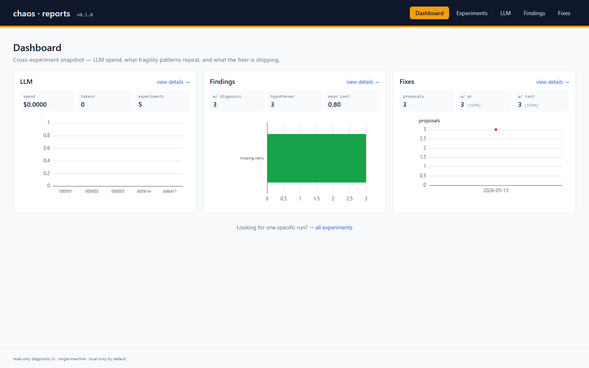

# Closing the loop on chaos engineering

*A short tour of `chaos-loop`: a multi-agent system that injects failure
into a real Kubernetes cluster, decides whether anything broke, opens a
draft PR with a fix, and shows you the receipts.*

---

## The gap nobody fills

Modern chaos-engineering tools — Chaos Mesh, Litmus, AWS FIS, Gremlin —
all stop at **injection**. They apply the CRD, the pod dies (or the
network drops, or the certificate expires), and a human reads a
dashboard, decides what (if anything) it means, files a Jira ticket, and
maybe writes a fix months later.

That gap — between *"we induced a regression"* and *"we have a reviewed
artifact that addresses it"* — is where most of the value of chaos
engineering leaks out. The point of chaos isn't to break things; it's
to **surface latent fragility and act on it**. Without the loop closing,
every chaos run is context dropped on the floor.

This project closes it. End-to-end, in one command.

---

## The cast

Five agents and an orchestrator. Each agent has a Pydantic-typed input
and output schema, a job, and zero authority over anyone else's
decisions.

<p align="center">
  
</p>

- **Tester** reads the target's source for fragility patterns (missing
  retries, sync-in-async, single-replica deployments, hard pod
  affinity, hard-coded secrets) and runs probes against Prometheus to
  capture a statistical baseline.
- **Chaos** renders one of seven fault catalogue entries (`network.loss`,
  `pod.kill`, `cert.revoke`, `image.swap_vuln`, …) into a Chaos Mesh CRD
  and applies it. Cleanup is deterministic, even on crash.
- **Security** scans for findings using Trivy / Syft / Grype / gitleaks
  / cosign / kubescape. Security regressions flow through the same loop
  as functional ones.
- **Diagnostician** correlates the chaos timeline against logs (Loki) +
  metrics (Prometheus) + the target's code, then proposes ranked
  hypotheses with cited evidence.
- **Fixer** decides on a fix class, writes the patch, adds a regression
  test, and opens a **draft PR**. Never auto-merges.

All five run behind the same `Protocol` interface, so a `Static*` rule-based
implementation can be swapped in for the LLM-backed one at zero cost
when the loop needs to run deterministically (CI, free tier, dev).

---

## The state machine

The orchestrator runs the loop as a deterministic state machine.
Every transition is persisted to SQLite so a mid-run crash is recoverable.

<p align="center">
  
</p>

A few rules baked in at the state-machine level, not at the agent level:

- **Baseline already showing regression aborts the run before any fault.**
  Chaos-testing a yellow system can turn it red. The gate is non-negotiable.
- **One fault per experiment** unless the plan opts in. Attribution
  matters: if two faults run at once, you don't know which one caused
  the regression.
- **Per-step budget checks.** Every spend-incurring agent call (LLM-backed
  hypothesize / diagnose / propose-fix) refreshes spend from the harness,
  then re-evaluates the hard cap before the next step. Hit it → abort.
- **The fixer never auto-merges.** Drafts only. Path denylist. Human
  reviews everything before it lands.

---

## The meta-harness

LLMs are the cognitive surface of this system. They're also the surface
that costs money, leaks data, hallucinates, and can loop. Every call
into an LLM-backed agent passes through a **meta-harness** wrapper.

<p align="right">
  
</p>

The harness is a `__getattr__` proxy: `harness.instrument("tester", agent)`
returns a transparent stand-in that satisfies the same Protocol as the
underlying agent. Sync attribute reads pass through; async method calls
get instrumented. The wrapped agent itself is read-only — `__setattr__`
raises — so a misbehaving caller can't mutate state on the proxy.

What it does on every coroutine invocation:

| Concern | How |
|---|---|
| **Observability** | Logs entry / exit / duration / error / one-line input + output summaries. INFO on success, WARNING on raise. |
| **Audit trail** | Builds an `AgentInvocation` record, appends to `harness.invocations`. The orchestrator attaches the full list to the SQLite record before every save, so a crash mid-run still leaves a forensic trail. |
| **Cost attribution** | Sets a per-task `ContextVar` to the current invocation. When the strategy calls `complete_with_tools`, that function reads the var and credits the call's `response_cost` to the invocation that triggered it — no harness reference plumbed through three constructors. |
| **Budget enforcement** | After every step in the loop, the orchestrator sums spend across the audit trail and re-checks the hard cap. Over budget → abort cleanly. |
| **Error propagation** | Exceptions always propagate. The harness records the error string for the audit log but does **not** swallow. A failing agent fails the experiment — silent partial success is not allowed. |

The pattern matters in practice:

- The orchestrator **never sees an LLM call directly**. It only sees
  agent invocations through `Protocol` interfaces. The harness is the
  border control.
- **Adding a new agent** doesn't require any harness change. Wrap with
  `harness.instrument("new-agent", instance)` and inherit
  observability, audit, cost attribution, and budget enforcement for
  free.
- **Control properties hold under nested calls.** N nested
  `complete_with_tools` calls credit their cost to the one invocation
  that started the outer agent method, via the ContextVar.

---

## What an operator sees

The UI surfaces the audit trail. The interesting screen is the **timeline**:
every agent invocation and every chaos-mesh CRD lifecycle event
interleaved by timestamp, chaos events highlighted with a peach band so
the injection window is unmistakable.

<p align="center">
  
</p>

That screenshot is from a real run — the `chaos.started` row carries the
actual `NetworkChaos/network-loss-00ddba11` CRD identifier that
chaos-mesh installed on the cluster. The 30-second gap between
`chaos.execute` start and end is the orchestrator holding while the
fault is in effect.

Cross-experiment views aggregate every run in the store:

<p align="center">
  
</p>

LLM spend per experiment, which fragility patterns recur across the
entire history, what the fixer agent has been shipping. The operator
clicks Pause / Resume / Abort from the same UI when something looks off.

---

## Try it

```bash
git clone <this-repo> chaos && cd chaos
python -m venv .venv && source .venv/bin/activate
pip install -e ".[dev]"

# Deterministic, no LLM, no API key needed:
chaos run experiments/examples/01-redis-network-loss.yaml --profile static

# Or just the UI against the dry-run store:
cd ui && pnpm install
pnpm --filter @chaos/ui-server start:dev
pnpm --filter @chaos/ui-web    start
```

The orchestrator's CLI lives in [`orchestrator/main.py`](../orchestrator/main.py).
The harness is [`agents/_harness.py`](../agents/_harness.py) — sub-300
lines that buy us everything in the table above. The UI's setup
walkthrough — with screenshots of every tab and the live-cluster wiring
— is in [`ui/README.md`](../ui/README.md).
