# chaos · reports UI

A diagnostic + control UI for the closed-loop chaos engineering orchestrator.
Reads the orchestrator's SQLite store to render each experiment as a six-tab
audit trail and four cross-experiment dashboards; writes only to the three
control-signal columns the orchestrator polls (`pause` / `resume` / `abort`)
and spawns new `chaos run` subprocesses from an allowlisted plan directory.


```
ui/
├── server/   Node + NestJS 11 · REST over the SQLite store + spawn API
└── web/      Angular 21 standalone + Signals · Material 3 SPA + ECharts
```

The orchestrator (Python, in the parent directory) is the primary writer.
The server opens a `readonly: true` reader connection for every browse
endpoint, plus a writer connection that touches **only** the control-signal
columns the orchestrator already polls between state transitions. The SPA
never talks to the database directly. The intent is to keep the UI from
ever standing between an in-flight chaos run and its operator.

## Quick start

You need [pnpm](https://pnpm.io/installation) 11 (the workspace uses
allowBuilds settings only pnpm understands) and Node 22+.

```bash
# from repo root
cd ui
pnpm install

# terminal 1 — backend on http://127.0.0.1:3000
pnpm --filter @chaos/ui-server start:dev

# terminal 2 — frontend on http://localhost:4200
pnpm --filter @chaos/ui-web start
```

Open <http://localhost:4200> — the SPA proxies `/api/*` to the server
through `web/proxy.conf.json`, so the browser only ever sees one origin.

If the orchestrator has never run on this machine the list will be empty
and the server will log a warning. Run an experiment (see
[Connecting to the chaos infra](#connecting-to-the-chaos-infra)) and the
list populates on the next refresh.

## What you see

### Experiments list

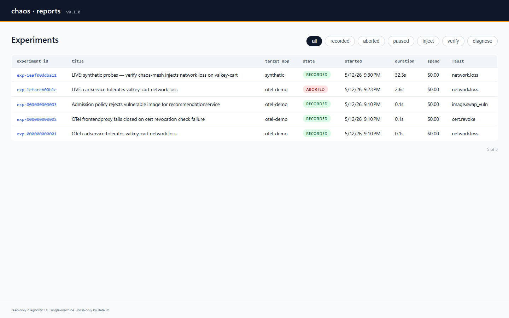

Every experiment that has ever landed in the store, newest first. State
chips are colour-coded — `RECORDED` (green) for clean runs, `ABORTED`
(red) for ones that fell out of a safety gate or steady-state check, and
amber for any in-flight phase (`inject`, `verify`, `diagnose`, …). The
filter row above the table scopes the list to a single state.

The columns are pulled from each record's plan and final state: the title,
the target app, when it started, how long it took, how much LLM spend it
incurred, and the primary fault that was injected. Click any row to drill
in.

### Detail · Overview tab

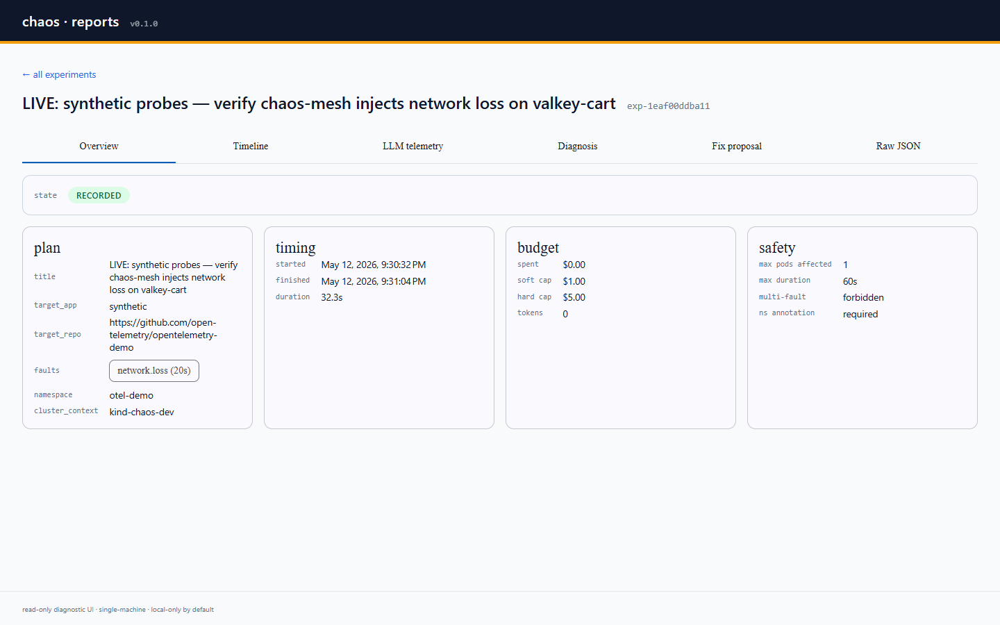

The first impression of a single experiment. Four cards across the top:

- **plan** — what was asked of the system (title, target app + repo, fault
  list, namespace + cluster context).
- **timing** — start, finish, wall-clock duration.
- **budget** — soft cap, hard cap, what was actually spent in USD, total
  prompt + completion tokens.
- **safety** — the gates this run was bound by (max pods affected, max
  duration, multi-fault policy, namespace-annotation requirement).

The state chip carries an `aria-label` so screen readers announce the full
phrase ("Experiment state: recorded"), not just the colour.

### Detail · Timeline tab


Every agent invocation (`▸`) and every chaos-mesh CRD lifecycle event
(`◣`) interleaved by timestamp. Chaos events are highlighted with a peach
band so you can spot the injection window at a glance. Each row shows
the offset from `t=0`, the absolute timestamp, the agent.method (or the
event), an optional summary, and how long it took.

The screenshot above is from a real run — the `chaos.started` row shows
the actual `NetworkChaos/network-loss-00ddba11` CRD identifier that
chaos-mesh installed in the cluster.

### Detail · LLM telemetry tab

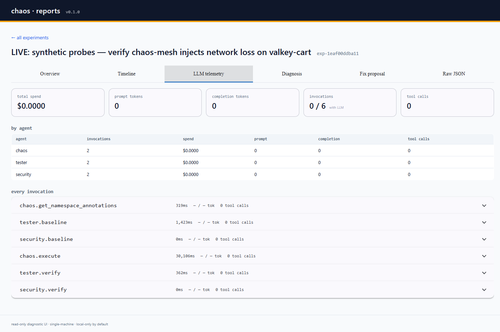

LLM spend, end to end. Five cards across the top roll up the experiment's
total spend, prompt tokens, completion tokens, invocation count
(LLM-using vs. total), and tool-call count. The `by agent` table breaks
the same numbers down per agent. Below that, every invocation is its own
expansion panel — open one to see the input summary, output summary, raw
tool calls and (if it failed) the error.

`$0.00` and `0` everywhere is correct for `--profile static` runs and
for `--dry-run` — no LLM calls happened. A `hybrid` or `llm` run shows
the actual cost.

### Detail · Diagnosis tab

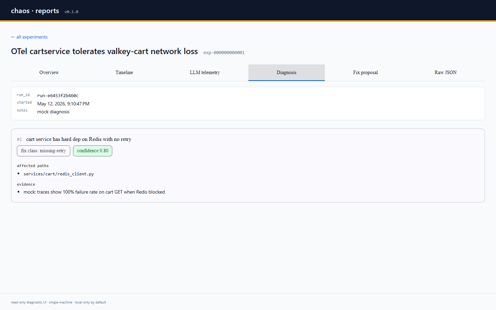

If a regression was detected during verify, the diagnostician proposes
ranked hypotheses about why. Each card shows a numeric rank, the human
summary, and two chips classifying the hypothesis: a `fix class:` slug
(`missing-retry`, `missing-circuit-breaker`, etc.) and a numeric
`confidence` score. The confidence chip is colour-coded — green ≥ 0.7,
amber ≥ 0.4, grey otherwise.

Below the chips, `affected paths` lists the files the diagnostician
fingered, and `evidence` lists the trace / metric anomalies that backed
the hypothesis up.

If verify reported the system as steady (no regression), this tab shows
a one-line empty state explaining why no diagnosis was run.

### Detail · Fix proposal tab

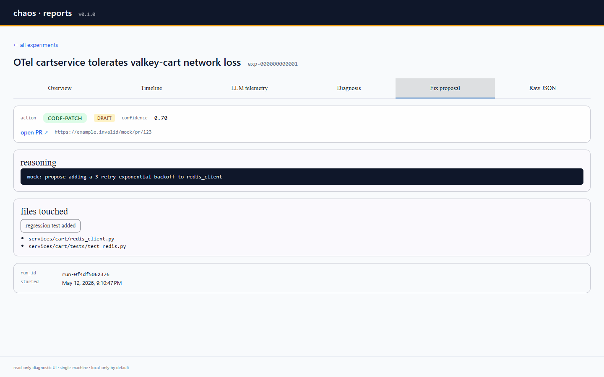

The fixer's recommended remediation. The action chip (`code-patch`,
`config-patch`, `none`) is colour-coded; `DRAFT` is amber; `confidence`
is the fixer's self-rating. If the fixer opened a PR, the URL is rendered
as a link with `rel="noopener noreferrer"` — but **only** when it parses
as `http(s)`; a `javascript:` or `data:` URL is shown verbatim with a
"blocked" warning instead of an executable link.

`reasoning` is the fixer's explanation in monospace, `files touched`
lists the patched paths, and a `regression test added` chip surfaces if
the fixer also added a test.

### Detail · Raw JSON tab

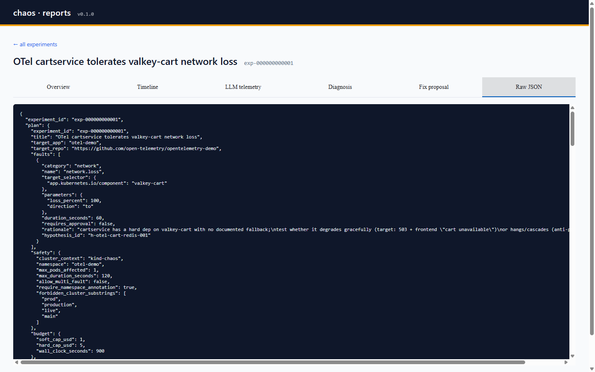

Escape hatch. Renders the full `ExperimentRecord` JSON blob exactly as it
sits in SQLite. Wrapped in `<ng-template matTabContent>` so the
`JsonPipe` only runs when this tab is opened — the other five tabs cost
nothing if you never touch this one.

### Aborted-state example

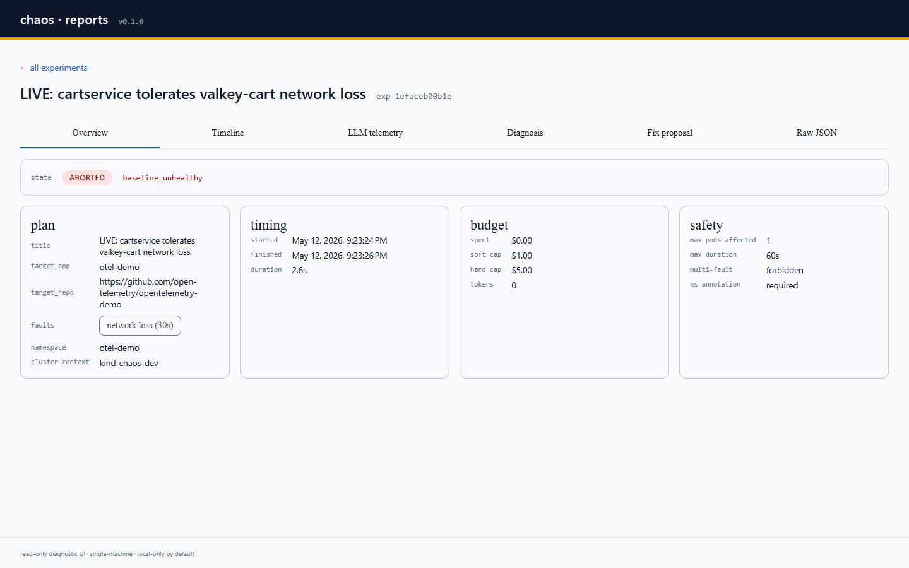

When an experiment trips a safety gate or fails its baseline steady-state
check, the run aborts before chaos is injected. The state chip turns
red, the `abort_reason` slug is rendered next to it, and the Diagnosis
+ Fix proposal tabs show empty-state copy explaining why those phases
never ran.

### Cross-experiment dashboards

#### Dashboard


Landing page. Three section cards in one glance: LLM spend totals + a
spend-per-experiment bar, Findings counts + a fix-class breakdown, Fixes
counts + a daily-throughput line. Each card links to its detail page.

#### LLM telemetry

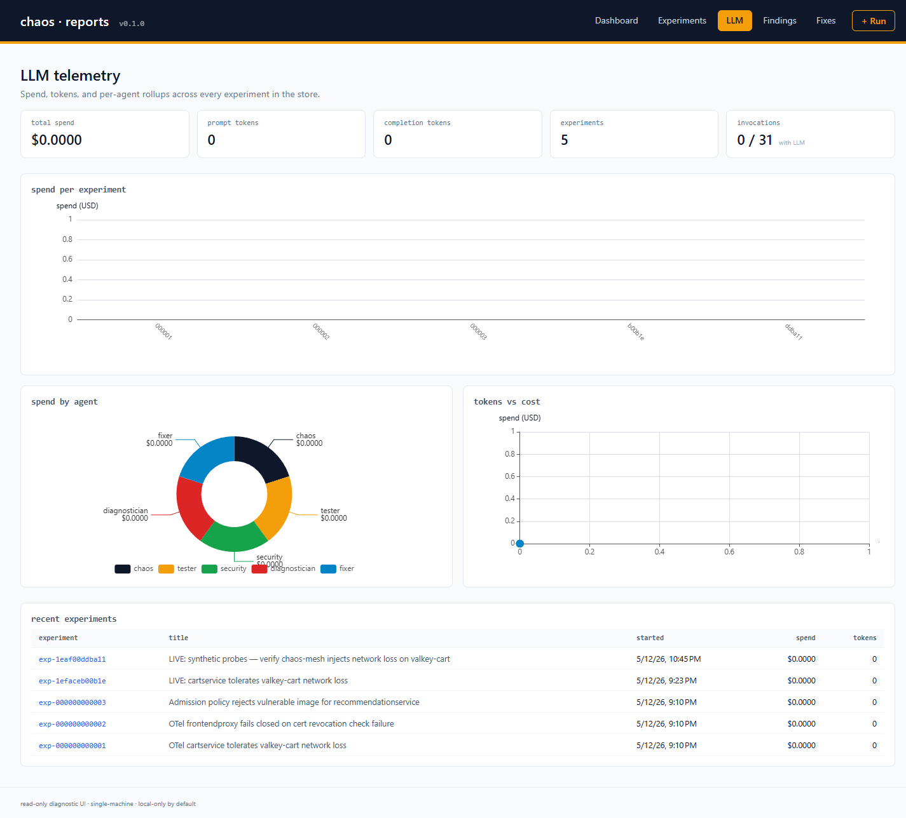

Spend, tokens, and per-agent rollups across every experiment in the
store. Spend-per-experiment bar, by-agent donut, tokens-vs-cost scatter
(useful for spotting expensive runs that didn't produce more value), and
a recent-experiments table that drills back into the detail page.

#### Findings

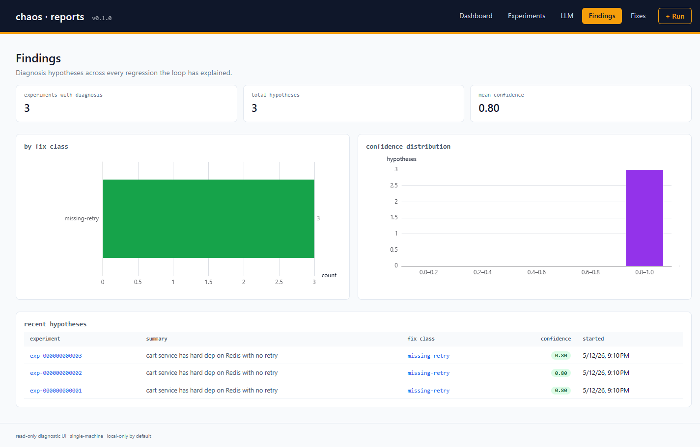

Diagnosis hypotheses across every regression the loop has explained. The
horizontal bar shows which `suggested_fix_class` slugs (`missing-retry`,
`missing-circuit-breaker`, …) recur, the histogram shows how confident
the diagnostician usually is. A recent-hypotheses table renders each
confidence as a green / amber / grey pill and links back to the
experiment.

#### Fixes

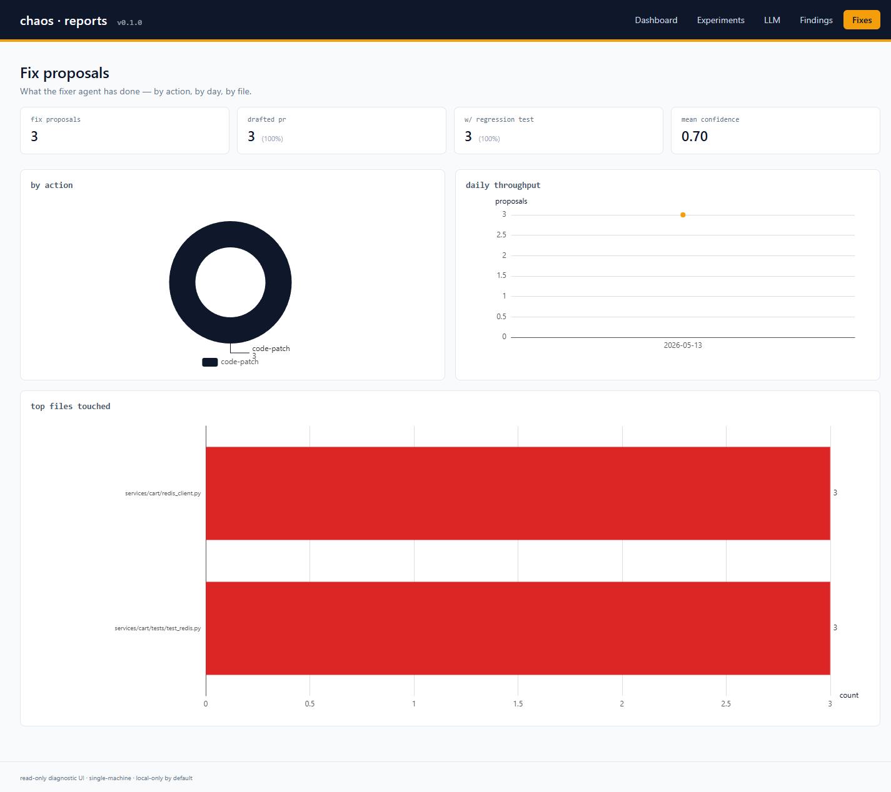

What the fixer agent has done — by action, by day, by file. A donut for
the action mix (`code-patch` vs `config-change` vs `none` vs `doc-only`),
a daily-throughput line + area chart, and the top-20 most-touched files
as a horizontal bar. KPIs at the top show how many proposals drafted a
PR and how many added a regression test.

### Control plane

The UI is the orchestrator's control plane: start a new experiment, pause
one mid-flight, resume it, or abort it cleanly.

#### `/run` — start a new experiment

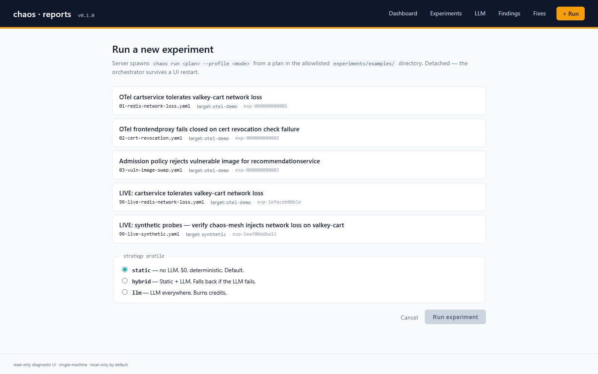

Lists every YAML in the allowlisted plan directory (default
`experiments/examples/`, override with `CHAOS_PLANS_DIR`). Pick a plan,
pick a profile (`static` / `hybrid` / `llm`), click Run. The server
spawns `python -m orchestrator.main run <plan> --profile <mode>` as a
detached subprocess, returns the parsed `experiment_id` immediately, and
the SPA redirects to `/experiments/:id` so you watch the audit trail
populate in real time. The orchestrator outlives a UI server restart.

Hardening: filenames are restricted to bare names in the allowlisted
directory — path traversal, absolute paths, and nested filenames all
reject with 400. `experiment_id` is regex-validated against the same
constraint the orchestrator's Pydantic schema enforces, so a typo
surfaces as an HTTP 500 with a clear message rather than as a 404
redirect later.

#### Pause / Resume / Abort

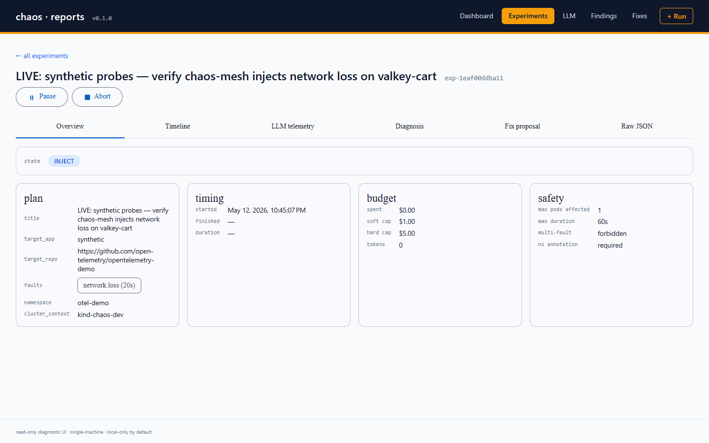

The detail page grows an action bar whenever the experiment is in a
non-terminal state (the complement of the orchestrator's `_LIVE_STATES`
— including `baseline_fail` and `inject_failed`, since the operator can
still abort an experiment stuck in a failure state). Clicking any
button writes a single column on the experiment row; the orchestrator
polls those columns once per second between state transitions and acts
accordingly:

| Button | What it sets | What the orchestrator does next |
|---|---|---|
| **Pause** | `pause_requested = 1` | parks the experiment in `PAUSED` at the next state boundary |
| **Resume** | `pause_requested = 0` | continues to the next state |
| **Abort** | `abort_requested = 1`, `abort_reason_requested = 'user_kill'` | tears down any in-flight chaos CRDs, transitions to `ABORTED` |

Abort prompts via `confirm()` first; the writer is idempotent so a
second click is harmless. Action buttons stay disabled across the
record reload to prevent double-clicks against a stale snapshot.

## Connecting to the chaos infra

The UI server reads from one file: the SQLite database the Python
orchestrator writes to. By default, both halves agree on
`~/.local/share/chaos/experiments.sqlite`; override with
`CHAOS_STORE_PATH` if you need to point them at something else.

A typical end-to-end loop, from a clean machine:

```bash
# 1. run an experiment from the orchestrator (writes to SQLite)
cd <repo-root>
PROM_URL=http://127.0.0.1:9090 \
  python -m orchestrator.main run \
    experiments/examples/99-live-synthetic.yaml \
    --profile static \
    --kube-context kind-chaos-dev

# 2. start the UI server (reads from the same SQLite)
cd ui
pnpm --filter @chaos/ui-server start:dev   # → http://127.0.0.1:3000

# 3. start the SPA
pnpm --filter @chaos/ui-web start          # → http://localhost:4200
```

The experiment shows up in the list immediately on next refresh — the
server reads SQLite in WAL snapshot mode, so reads never block the
orchestrator's writes.

### Running a real chaos experiment against a kind cluster

The plan referenced above (`99-live-synthetic.yaml`) does what its name
says: drives chaos-mesh end-to-end against the live cluster. To set up
the prerequisites for that plan (or any other plan that targets
`otel-demo`):

```bash
# kind cluster + chaos-mesh — see ../infra/README.md for the full setup
kubectl --context kind-chaos-dev get ns chaos-mesh

# target namespace must carry the safety annotation, or every plan aborts
kubectl --context kind-chaos-dev create namespace otel-demo
kubectl --context kind-chaos-dev annotate namespace otel-demo \
  chaos.kosta.dev/allowed=true --overwrite

# install otel-demo (Helm) — gives you a real app to break
helm repo add open-telemetry https://open-telemetry.github.io/opentelemetry-helm-charts
helm install otel-demo open-telemetry/opentelemetry-demo \
  --kube-context kind-chaos-dev --namespace otel-demo \
  --set 'default.replicas=1'

# expose Prometheus to the host — the tester probes need it
kubectl --context kind-chaos-dev -n otel-demo \
  port-forward svc/prometheus 9090:9090 &
```

Now `python -m orchestrator.main run …` will:

1. resolve the kube context, fetch namespace annotations, gate the run
2. drive a chaos-mesh `NetworkChaos` CRD into the cluster
3. wait for the configured duration, then clean the CRD up
4. re-run the verify probes against Prometheus
5. write the full audit trail to SQLite

…and the row pops up in the UI at `/experiments`.

### Without a cluster (dry-run)

If you want to iterate on the UI itself without standing up a kind cluster
at all:

```bash
python -m orchestrator.main run \
  experiments/examples/01-redis-network-loss.yaml --dry-run
```

Mocked agents, no LLM, no cluster — but the record that lands in SQLite
has the full shape of a real one (all eight agent invocations, a fake
`NetworkChaos` lifecycle, a mock diagnosis with one hypothesis, a mock
fix proposal). Perfect for UI development.

## Environment

| Var | Default | Purpose |
|---|---|---|
| `CHAOS_STORE_PATH` | `~/.local/share/chaos/experiments.sqlite` | SQLite file the orchestrator writes to. The server warns and serves an empty list if it doesn't exist. |
| `CHAOS_PLANS_DIR` | `<repo>/experiments/examples/` | Allowlisted directory for `/run`. Only YAML files in this directory show up in the plan picker and are accepted by the spawn endpoint. |
| `CHAOS_PYTHON` | `<repo>/.venv/Scripts/python.exe` (Win) or `<repo>/.venv/bin/python` (POSIX) if it exists, else `python` | Interpreter the spawn endpoint uses for `python -m orchestrator.main run …`. Override to point at a system Python or a different venv. |
| `CHAOS_UI_PORT` | `3000` | Server port. |
| `CHAOS_UI_BIND` | `127.0.0.1` | Bind address. **Local-only by default.** Only set to `0.0.0.0` after you've also set `CHAOS_UI_API_KEY`. |
| `CHAOS_UI_API_KEY` | unset | Optional bearer-token auth. Required when binding to anything other than localhost. |

## Test

```bash
pnpm --filter @chaos/ui-server test    # 50 jest tests
pnpm --filter @chaos/ui-web    test    # 36 vitest tests (zoneless Angular)
```

Both halves run on CI on every push under the `ui` job in
[`.github/workflows/ci.yml`](../.github/workflows/ci.yml). The same job
also runs `pnpm --filter <half> build` so a typecheck or template error
trips CI even if no test exercises the affected file.

## Build (production)

```bash
pnpm --filter @chaos/ui-server build   # → ui/server/dist/
pnpm --filter @chaos/ui-web    build   # → ui/web/dist/web/
```

In production:

- Serve `ui/web/dist/web/` from any static host (caddy, nginx, S3 + CloudFront).
- Run `node ui/server/dist/main` behind a reverse proxy, with
  `CHAOS_UI_BIND=0.0.0.0` + `CHAOS_UI_API_KEY=<…>`. Every read endpoint
  rejects requests without the matching `Authorization: Bearer <key>`
  header.
- Configure the static host to proxy `/api/*` to the server. There is no
  CORS allow-list in the server; locking origins down is the proxy's job.

## API

### Read

| Method | Path | Returns |
|---|---|---|
| `GET` | `/api/v1/health` | Boot status + uptime. |
| `GET` | `/api/v1/experiments` | Paginated `ExperimentSummary[]`. Filter with `?state=`, `?target_app=`, `?from=`, `?to=`, `?limit=`, `?offset=`. |
| `GET` | `/api/v1/experiments/:id` | Full `ExperimentRecord`. 404 if no such id. |
| `GET` | `/api/v1/experiments/:id/control` | `ControlSignals` for an in-flight experiment (pause / abort flags). Cheap — one row, one query. |
| `GET` | `/api/v1/aggregates/llm` | Cross-experiment LLM rollups (totals + by-agent + by-experiment). Optional `?from=`/`?to=` ISO-8601 datetime window. |
| `GET` | `/api/v1/aggregates/findings` | Hypothesis class counts + confidence histogram + 50 most recent. |
| `GET` | `/api/v1/aggregates/fixes` | Fix action counts + daily PR throughput + top-20 most-touched files. |
| `GET` | `/api/v1/plans` | Plan files in the allowlisted directory (header fields only). |

### Control plane

| Method | Path | Effect |
|---|---|---|
| `POST` | `/api/v1/experiments/:id/pause` | Sets `pause_requested = 1`. 204. |
| `POST` | `/api/v1/experiments/:id/resume` | Clears `pause_requested`. 204. |
| `POST` | `/api/v1/experiments/:id/abort` | Body: `{ "reason"?: AbortReason }` (default `user_kill`). Sets `abort_requested` + reason. 204. |
| `POST` | `/api/v1/experiments/run` | Body: `{ "filename": string, "profile"?: "static"\|"hybrid"\|"llm" }`. Spawns `python -m orchestrator.main run …` detached, returns `{ experiment_id, title, target_app, profile }`. 202. |

The TypeScript contracts in [`server/src/contracts/`](server/src/contracts/)
mirror the Pydantic models in `../shared/contracts.py` field-for-field; if
the orchestrator changes a field, both halves break in CI before the
mismatch reaches a release.

## Why this stack

- **NestJS** — same module / DI / decorator architecture as Angular, so
  both halves of the workspace share an architectural taste.
- **Angular 21 standalone + Signals** — current stable Angular at time of
  writing; signals + zoneless change detection keep the SPA fast on slow
  hardware (operators may run this from cheap laptops in incident
  rooms).
- **Material 3 (Angular Material 21)** — a token-based theme system means
  the UI inherits decent-looking primitives for free, and re-skinning is
  one `mat.theme()` call away.
- **better-sqlite3** — synchronous, zero-overhead reads via a `readonly: true`
  connection. A second writable connection is opened **only** for the three
  control-signal columns the orchestrator polls; both halves agree those
  columns are racy and idempotent so two writers can coexist on the same
  row safely.
- **Detached subprocess for `chaos run`** — the spawned orchestrator
  uses `child.unref()`, so a UI server restart never kills an in-flight
  chaos run. The orchestrator writes its audit trail straight to SQLite;
  the UI just renders whatever shows up.
- **pnpm workspace** — deterministic, fast, hard about phantom deps.
  Workspace mode unifies the two halves under one lockfile so a contract
  change can land in both packages atomically.
- **Vitest for the Angular half** — faster startup than Karma + Jasmine,
  and the `provideZonelessChangeDetection` test bed plays nicely with
  Vitest's worker model.

## See also

- [`../infra/README.md`](../infra/README.md) — kind cluster +
  chaos-mesh setup that the live experiments above target.
- [`../docs/SAFETY.md`](../docs/SAFETY.md) — the safety properties the UI
  must not subvert (and why the server is read-only).
- [`../shared/contracts.py`](../shared/contracts.py) — the Pydantic
  ground truth that this UI's TypeScript contracts mirror.
- [`../SECURITY.md`](../SECURITY.md) — vulnerability reporting.
